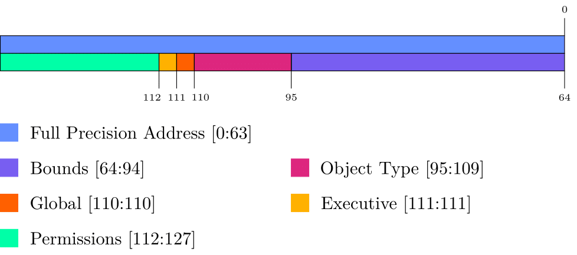

# Capabilities

At the core of CHERI are its capabilities. This page introduces them and explains the concepts and goals.

## Definition

!!! abstract "Definition: Capability"
    ~ unforgeable tokens of authority, used to implement

    - explicit pointers (declared in the language);
    - implied pointers (used by runtime and generated code) (e.g. in C for memory protection to directly mitigate a broad range of known vulnerability types & exploit techniques).

    Capabilities are hardware-supported descriptions of permissions that can be used, in place of integer addresses, to refer to data, code, and objects in protected ways.

## Description

Capabilities protect (virtual) addresses (code or data pointers)

1. such as source-language pointers;
2. used in the underlying implementations of language features such as local and global variables, thread-local storage, return addresses, vtable pointers, inter-library linkage.

**All memory accesses (loads, stores, instruction fetch) must be authorized by a capability!** Capabilities are held in registers and in memory (as with existing kinds of hardware-supported data (integers, floats, vectors)). They are loaded, stored and manipulated using new **capability-aware instructions**.

This composes well with current RISC architectures, microarchitectures, compiler implementations, operating-system designs & application structure.

The authoritative architecture reference is the [**CHERI ISA Specification**][cheri-isa-specification]. It describes the overall research approach, architecture-neutral protection model, mappings into \[...\] 32/64-bit RISC-V architectures and it provides a detailed design rationale for a number of key CHERI design choices.

[cheri-isa-specification]: https://www.cl.cam.ac.uk/techreports/UCAM-CL-TR-951.pdf

## Visualization

{ loading=lazy }

Capabilities are twice (actually 2x + 1) the width of native integer pointer type of the baseline architecture, and they consist of

1. an integer address of the natural size for the architecture ("**full precision address**") (light blue, upper half in the image above)
2. **metadata**, compressed to fit in the remaining bits (lower half)
3. a **validity tag** (1 Bit) (not displayed in the image above)

The validity tag is maintained in registers and in memory by the architecture.

## Components

Each element of a capability contributes to the protection model and is enforced by hardware. The elements are:

1. **Validity Tag**: tracks the validity of a capability
    - if invalid, a capability cannot be used for load, store, instruction fetch, or other operations
    - it is still possible to extract fields from an invalid capability, including address
    - **capability-aware instructions** maintain this tag (if desired) as caps are loaded / stored, and when capability fields are accessed, manipulated, and used – as long as the [rules for capability usage](#rules-for-capability-usage) are respected
2. **Bounds**: (lower/upper) describe the portion of the address space to which a capability authorizes loads, stores, and/or instruction fetches
3. **Permissions**: (mask) controls how a capability can be used
    - examples: restricting loading/storing of data and/or capabilities; prohibiting instruction fetch
4. **Object Type**: indicates whether the capability is sealed for this object type
    - when a capability is sealed, it cannot be modified or dereferenced
    - sealed capabilities are used to implement opaque pointer types

## Rules for Capability Usage
