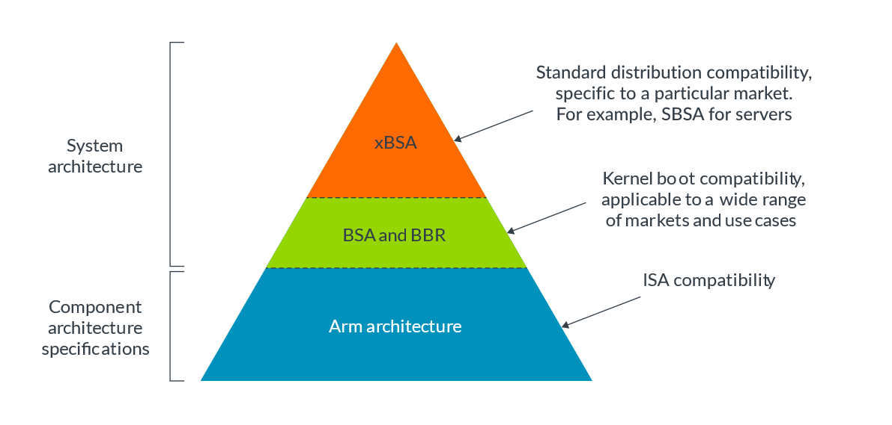
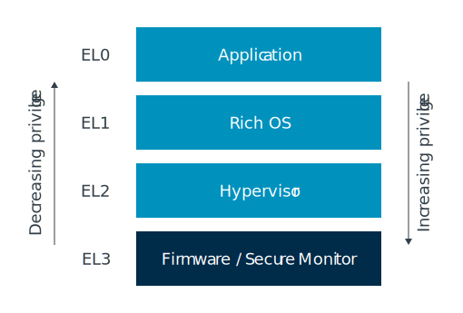
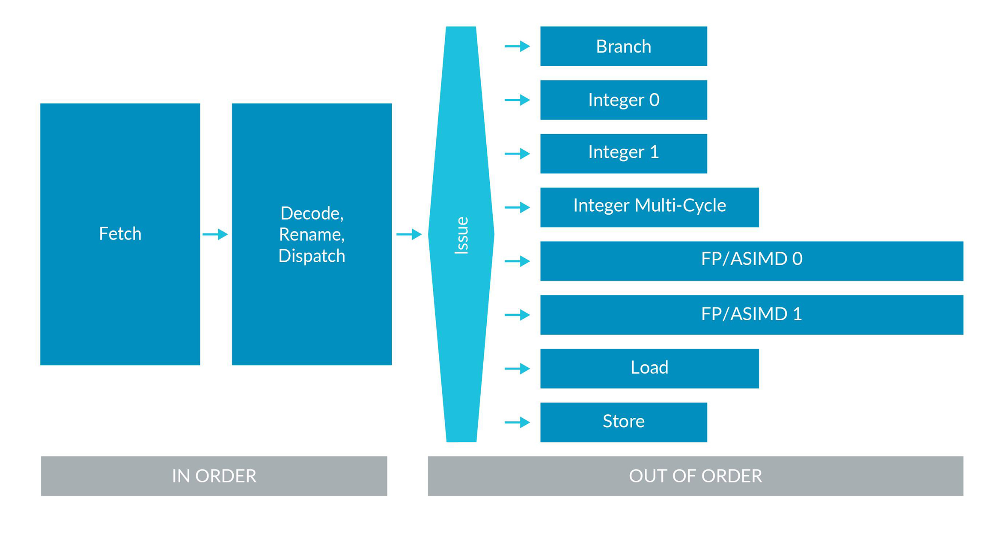

---
hide:
  - navigation
---

# :door: Introduction

The ARM Architecture is integrated into a range of technologies, ranging from SoC devices (like smartphones), microcomputers, embedded devices, servers and even supercomputers. ARM exposes a common ISA & worflow to help with interoperability across different implementations of the architecture.

## [Architectures][arm-dev-docs--introduction]

[arm-dev-docs--introduction]: https://developer.arm.com/documentation/102404/0201?lang=en

This section provides general information about what an architecture is, what subdivisions of it exist, and how all of this is connected.

### What Actually Is an _Architecture_?

!!! abstract "Definition: Architecture"
    ~ is a **functional specification**. In case of the Arm architecture, it's the functional specification of a processor. It specifies how a processor will behave, i.e. what instructions it has and what the instructions do. It is **a contract between hardware and software**, specifying what functionality software can rely on the hardware to provide. Some features are optional, see [this subsection](#architecture-vs-microarchitecture).

The architecture specifies

1. the **instruction set**: the function of each instruction & how instructions are represented in memory (encoding)
2. the **register set**: how many, sizes, functions & initial state
3. the **exception model**: different levels of privilege, types of exceptions & what happens when taking and returning from exceptions
4. the **memory model**: memory (access) ordering & cache behavior (when software must perform explicit maintenance)
5. debug, trace & profiling: setting and triggering breakpoints & what info can be captured by trace tools and in what format

### System Architecture

Systems include more that just a processor core. ARM provides **specifications** to describe requirements for systems containing a processor.

{ loading=lazy }

Specifications are the **basis of software compatibility**. The system architecture consists of

1. **Component Architecture Specification**
    - first layer providing a common programmer's model (i.e. common instruction set & workflow) to software through ISA compatibility
2. **System Architecture**, containing
    1. **Base System Architecture** (BSA)
        - describes a hardware system architecture that system software can rely on
        - covers aspects of processor and system architecture, e.g. interrupt controller, timers, other common devices
        - provides reliable platform for standard OSs, hypervisors & firmware
        - applicable across different markets and use cases
        - other standards can build on BSA to provide market-specific standardization
    2. **Base Boot Requirements** (BBR)
        - establishes firmware interface requirements, e.g. PSCI, SMCCC, UEFI, ACPI, SMBIOS
        - covers requirements for systems based on the Arm architecture and that operating systems and hypervisors can rely on
        - provides the recipes for targeting specific use cases (point 3)
    3. xBSA, e.g. SBSA
        - supplement to the BSA that targets servers
        - describes the hardware and feature requirements for a server OS
        - ensures that operating systems, hypervisors and firmware operate correctly

BBR also provides the recipes for targeting specific use cases

1. SBBR: Specifying UEFI, ACPI, and SMBIOS requirements to boot generic, off-the-shelf operating systems and hypervisors
2. EBBR: Specifying, along with the EBBR specification, UEFI requirements to boot generic, off-the-shelf operating systems
3. LBRR: ...

### Architecture vs. Microarchitecture

The architecture does _not_ tell how a processor is built or how it works. The build and design is referred to as micro-architecture.

!!! abstract "Definition: Micro-Architecture"
    ~ tells you how a particular processor works. It includes pipeline length and layout, the number and sizes of caches, cycle counts for individual instructions & which optional features are implemented.

### Profiles

Profiles allow tailoring an architecture to different use cases while sharing several base features. There are three profiles:

1. **A** (Application): high-performance | complex (operating) systems
2. **R** (Real-Time): common in infrastructure with real-time demands | networking & embedded devices
3. **M** (Microcontroller): small but highly power efficient | IoT devices

### Extensions

Development of major versions of the Arm architecture can take many years. Because the architecture needs to evolve between major versions to add new features, minor versions, called extensions, are added. There is now an annual release of a extension. The Arm Architecture Reference Manual provides information on which features are optional or mandatory in different versions of the Armv8.x-A and Armv9.x-A architectures. There is [a list on the ARM Developer Documentation][arm-dev-docs--extentions-list] that lists the most important extensions for ARMv8.x and ARMv9.x.

??? example "Architecture, ISA, Version, Revision/Extension & More"

    When using the term _ARMv9.2-A_, you imply that your are talking about

    1. the Arm architecture
    2. version 9
    3. revision/extension 2
    4. with profile A (Application)
    5. that has the instruction set A64 (64bit)

[arm-dev-docs--extentions-list]: https://developer.arm.com/documentation/102378/0201/Armv8-x-and-Armv9-x-extensions-and-features

### Other Architectures

The Arm architecture is the best known, but not the only one! Similar specifications for other components on SoCs include

1. GIC: Generic Interrupt Controller
2. SMMU (sometimes IOMMU): System Memory Management Unit
3. Generic Timer
4. AMBA: Advanced Microcontroller Bus Architecture

### Development & An Example

ARMv8.2-A is version 8 of the Arm architecture, profile A, revision 2 - for short, v8.2-A. v9-A builds on v8-A & adds Scalable Vector Extensions version 2 (SVE2), Transactional Memory Extensions (TME), etc. Some of the features that were optional in Armv8-A are mandatory in ARMv9-A. Updates to the architecture are published annually, adding new instructions and features: v9.0-A aligns with v8.6-A, inheriting all features + adding new features.

## [Privilege, State & Exceptions][arm-dev-docs--exception-model]

[arm-dev-docs--exception-model]: https://developer.arm.com/documentation/102412/0103

This section introduces the exception and privilege model. Modern software is developed to be split into different modules, each with a different level of access to system and processor resources. The Arm architectures enable this split by implementing different levels of privilege.

### Exception Levels (ELs) & Exception Model

{ loading=lazy align=right }

There exist four ELs:

1. EL0 - least privilege, called "unprivileged execution"
2. EL1
3. EL2 - provides support for processor virtualization
4. EL3 - provides support for two [security states](#security-states)

Execution can move between ELs only on _taking_ an exception, or on _returning_ from an exception! On taking an exception, the EL either increases or remains the same. The EL cannot decrease on taking an exception. On returning from an exception, the EL either decreases or remains the same. The EL cannot increase on returning from an exception. The target EL is either implicit or defined by system registers; EL0 cannot be a target EL.

### Types of Privilege & Registers

There are two types of privilege relevant to the AArch64 (see [Execution States](#execution-states) later) exception model:

1. Privilege in the memory system
2. Privilege from the point of view of accessing processor resources

Both types of privilege are affected by the current privileged EL.

In the Arm architecture, registers are split into two main categories:

1. Registers that provide system control or status reporting
2. Registers that are used in instruction processing, for example to accumulate a result, and in handling exceptions

Configuration settings for AArch64 processors are held in a series of registers known as **System Registers**. The combination of settings in the System registers defines the **current processor context**.

### Security States

There can be two security states:

1. Secure State
    1. access both Secure and the Non-secure memory address space
    2. at EL3, access all the system control resources
2. Non-Secure State
    1. access only Non-secure memory address space
    2. cannot access the Secure system control resources

### Execution States

!!! abstract "Definition: Execution State"

    ~ defines the standard width of the general-purpose register and the available instruction sets. It also affects aspects of the memory model, execution model,  virtual memory system architecture (VMSA) and how exceptions are managed (exception model).

On ARMv8 and ARMv9, two execution states are supported:

1. **AArch64**
    - features 31 64-bit general-purpose registers, with a 64-bit Program Counter (PC), Stack Pointer (SP), and Exception Link Registers (ELRs)
    - provides a single instruction set: **A64**
    - defines the ARMv8 exception model, with four Exception levels, EL0-EL3, that provide an execution privilege hierarchy
    - features 48-bit Virtual Address (VA), held in 64-bit registers. The Cortex-A57 MPCore multiprocessor VMSA maps these to 44-bit Physical Address (PA) maps
    - defines a number of elements that hold the processor state (PSTATE). The A64 instruction set includes instructions that operate directly on various PSTATE elements
    - names each System register using a suffix that indicates the lowest Exception level that the register can be accessed
2. **AArch32** (backwards-compatible with implementations of the ARMv7-A architecture profile)
    - features 13 32-bit general purpose registers, and a 32-bit PC, SP, and Link Register (LR). Some of these registers have multiple Banked instances for use in different processor modes
    - provides 32 64-bit registers for Advanced SIMD and Floating-point support
    - provides two instruction sets, **A32** and **T32**. For more information, see Instruction set state
    - provides an exception model that maps the ARMv7 exception model onto the ARMv8 exception model and Exception levels
    - features 32-bit VAs. The VMSA maps these to 40-bit PAs
    - collects processor state into the Current Processor State Register (CPSR)

The processor can move between execution states only on a change of exception level. This change is also subject to [certain rules][arm-dev-docs--execution-state-change-rules].

[arm-dev-docs--execution-state-change-rules]: https://developer.arm.com/documentation/ddi0488/d/programmers-model/armv8-architecture-concepts/rules-for-changing-exception-state?lang=en

### Exception Types

#### Synchronous Exceptions

Synchronous exceptions are exceptions that can be caused by, or are related to, the instruction that is currently being executed. Synchronous exceptions are synchronous to the execution stream, as they are directly related to the currently executing instruction.

If the following all apply, then an exception is synchronous:

1. The exception has been generated as a result of direct, or attempted, execution of an instruction.
2. The address to return to once the exception has been handled (return address) has an architecturally-defined relationship with the instruction that caused the exception.
3. The exception is precise, meaning the register state presented on entry to the exception handler is consistent with every instruction before the offending instruction having been executed, and none after it.

There are many different types of synchronous exception, and it is possible that a given instruction might cause multiple synchronous exceptions. The Arm architecture provides a fixed priority order for synchronous exceptions. Some of the synchronous exception types are:

1. Invalid instructions and trap exceptions
2. Memory accesses
3. Exception-generating instructions
4. Debug exceptions

---

Exception-generating instructions can be used to implement system call interfaces to allow less privileged software to request services from more privileged software. The Arm architecture includes the exception-generating instructions `SVC` (`EL0` -> `EL1`), `HVC` (`EL1` -> `EL2`), and `SMC` (`EL2` -> `EL3`).

#### Asynchronous Exceptions

Asynchronous exceptions are not directly associated with the current executing instructions, and are typically system events from outside the processor. By definition, an exception is asynchronous if it is not synchronous. Asynchronous exceptions are also known as interrupts.

Physical interrupts include:

1. SError: intended to be generated by the memory system in response to unexpected events
2. IRQ/FIQ: intended to be used to support handling of peripheral interrupts
3. Virtual Interrupts: used for virtualization

### Handling Exceptions

#### General Information on Handling Exceptions

In AArch64 specific terminology is used when talking about taking an exception:

- When the Processing Element (PE, usually a processor core) responds to an exception, an exception is¢ taken.
- The PE state immediately before taking the exception is the state the exception is taken from.
- The PE state immediately after taking the exception is the state the exception is taken to.

!!! example

    It is possible to take an exception from AArch32 EL0 to AArch64 EL1.

After an exception has been handled, the system needs to return from the state it has been taken to. This is known as an Exception return, and the Arm architecture has instructions that trigger an Exception return:

- The state that the PE is in at the point the return instruction is executed is the state that the exception returns from.
- The PE state immediately after the exception return instruction has executed is the state that the exception returns to.

#### Taking an Exception

When an exception occurs, the processor saves the current status of the PE alongside the exception return address, and then enters a specific mode to handle the exception. When an exception is taken to an Exception Level (`ELx`) that is using AArch64 state, all of the following occur:

- The contents of `PSTATE` immediately before the exception was taken is written to `SPSR_ELx`.
- The preferred exception return address is written to `ELR_ELx`.
- For synchronous exceptions and SError interrupts, exception syndrome information (the cause of the exception) is written to `ESR_ELx`.
- For address-related synchronous exceptions, such as MMU faults, the virtual address that triggered the exception is written to the Fault Address Register, `FAR_ELx`.

Exception handling for any given exception starts from a fixed memory address called an exception vector. When an exception occurs the PE branches to a location in a vector table.

!!! note

    Vector tables in AArch64 are different to many other processor architectures as they contain instructions, not addresses. Each entry contains up to 32 instructions ; just enough to perform basic stacking and call exception-specific handling code.

    Vector tables exists for every exception level (except for `EL0` of course), with the base address defined by its own Vector Base Address Register, `VBAR_ELx`.

AArch64 has a concept of processor state known as `PSTATE` (on ARMv8 and later this is not a register), it is this information that is stored in the `%SPSR`. `PSTATE` contains things like current Exception level and Arithmetical Logical Unit (ALU) flags. In AArch64, this includes condition flags, execution state controls, exception mask bits, access control bits, timing control bits and speculation control bits.

!!! tip

    The Arm Developer Documentation provides [a page with examples when it comes to exception handling][arm-dev-docs--exception-handling].

    [arm-dev-docs--exception-handling]: https://developer.arm.com/documentation/102412/0103/Handling-exceptions/Exception-handling-examples

## Memory Management

!!! abstract "Definition: Memory Management"

    Memory management describes how access to memory in a system is controlled. The hardware performs memory management every time that memory is accessed by either the OS or applications. Memory management is a way of dynamically allocating regions of memory to applications.

    [Source][arm-dev-docs--memory-manegement-definition]

    [arm-dev-docs--memory-manegement-definition]: https://developer.arm.com/documentation/101811/0102/What-is-memory-management-

The benefit of using virtual addresses is that it allows management software, such as an Operating System (OS), to control the view of memory that is presented to software. The OS can control what memory is visible, the virtual address at which that memory is visible, and what accesses are permitted to that memory. This allows the OS to sandbox applications (hiding the resources of one application from another application) and to provide abstraction from the underlying hardware.

### Address Spaces

#### Virtual Address Spaces

There are several independent virtual address spaces in AArch64. Each of these virtual address spaces is independent, and has its own settings and (translation) tables. We often call these settings and tables "translation regimes". Because there are multiple virtual address spaces, it is important to specify which address space an address is in. For example, `NS.EL2:0x8000` refers to the address `0x8000` in the Non-secure EL2 virtual address space.

#### Translation

A virtual address must be translated to a physical address before a memory access can take place (because we must know which physical memory location we are accessing). This need for translation also applies to cached data, because on Armv6 and later processors, the data caches store data using the physical address (addresses that are physically tagged). Therefore, the address must be translated before a cache lookup can complete.

#### Physical Addresses

As well as multiple virtual address spaces (VAS), AArch64 also has multiple physical address spaces (PAS). Which physical address space, or spaces, a virtual address can be mapped to depends on the current Security state of the processor.

#### Address Sizes

AArch64 is a 64-bit architecture, but this does not mean that all addresses are 64-bit.

For virtual addresses, each region of address space has a size of up to 52-bits. The `TnSZ` fields in the `TCR_ELx` registers control the size of the virtual address space. The size of a physical address is implementation defined, up to a maximum of 52 bits.

#### Address Space Identifiers

Many modern OSs have applications that all seem to run from the same address region (user space). In practice, different applications require different mappings. This means, for example, that the translation for VA `0x8000` depends on which application is currently running.

Ideally, we would like the translations for different applications to coexist within the Translation Lookaside Buffers (TLBs), to prevent the need for TLB invalidates on a context switch. But how would the processor know which version of the VA 0x8000 translation to use? In Armv8-A, the answer is Address Space Identifiers (ASIDs).

For the EL0/EL1 virtual address space, translations can be marked as Global (G) or Non-Global (nG) using the nG bit in the attributes field of the translation table entry. For example, kernel mappings are Global translations, and application mappings are Non-Global translations. Global translations apply whichever application is currently running. Non-Global translations only apply with a specific application.

Non-Global mappings are tagged with an ASID in the TLBs. On a TLB lookup, the ASID in the TLB entry is compared with the currently selected ASID. If they do not match, then the TLB entry is not used.

### Virtualization

In virtualization, we call the set of translations that are controlled by the OS, Stage 1. The Stage 1 tables translate virtual addresses to intermediate physical addresses (IPAs). In Stage 1 the OS thinks that the IPAs are physical address spaces. However, the hypervisor controls a second set of translations, which we call Stage 2. This second set of translations translates IPAs to physical addresses.

EL0/EL1 translations can also be tagged with a Virtual Machine Identifier (VMID). VMIDs allow translations from different VMs to coexist in the cache. This is similar to the way in which ASIDs work for translations from different applications. In practice, this means that some translations will be tagged with both a VMID and an ASID, and that both must match for the TLB entry to be used.

## Instruction Set Architecture (ISA)

The Arm ISA allows you to write software and firmware that conforms to the Arm specifications. This mean that, if your software or firmware conforms to the specifications, any Arm-based processor will execute it in the same way.

The 64-bit Armv8-A architecture, also known as AArch64, runs the A64 instruction set. All instructions are detailed in the [Arm Architecture Reference Manual]. Every Arm Architecture Reference Manual provides a detailed description of each instruction, including:

- Encoding - the representation of the instruction in memory.
- Arguments - inputs to the instruction.
- Pseudocode - what the instruction does, as expressed in Arm pseudocode language.
- Restrictions - when the instruction cannot be used, or the exceptions it can trigger.

[Arm Architecture Reference Manual]: https://developer.arm.com/documentation/ddi0487/latest/

### Sequential Execution Model

The Arm architecture describes instructions following a Simple Sequential Execution (SSE) model. This means that the processor behaves as if the processor fetched, decoded and executed one instruction at a time, and in the order in which the instructions appeared in memory. In practice, modern processors have pipelines that can execute multiple instructions at once, and may do so out of order. This diagram shows an example pipeline for an Arm Cortex processor:



The architecture is a functional description. This means that it does not specify how an individual processor works. Each processor must behave consistently with the simple sequential execution model, even if it is reordering instructions internally.

### Registers

#### General-Purpose Registers

The architecture provides 31 general purpose registers. Each register can be used as a 64-bit `X` (extended) register (`X0`..`X30`), or as a 32-bit `W` (word) register (`W0`..`W30`). When a `W` register is written, as seen in the example above, the top 32 bits of the 64-bit register are zeroed.

There is a separate set of 32 registers used for floating point and vector operations. These registers are 128-bit, but like the general-purpose registers, can be accessed in several ways: `Bx` (byte) is 8 bits, `Hx` (halfword) is 16 bits, `Sx` (single) is 32 bits, `Dx` (double) is 64 bites and `Qx` (quad) which is 128 bits. These registers can also be referred to as `V` registers. When the `V` form is used, the register is treated as being a vector. This means that it is treated as though it contains multiple independent values, instead of a single value.

#### Other Registers

- the zero registers, `XZR` and `WZR`, always read as 0 and ignore writes
- `X30` is used as the Link Register and can be referred to as `LR`; separate registers, `ELR_ELx`, are used for returning from exceptions
- the Program Counter (`PC`) is not a general-purpose register in A64
    - it cannot be used with data processing instructions
    - PC can be read using `ADR Xd, .`
- you can use the stack pointer (`SP`) as the base address for loads and stores
    - you can also use the stack pointer with a limited set of data-processing instructions, but it is not a regular general purpose register
    - Armv8-A has multiple stack pointers, and each one is associated with a specific Exception level
    - when SP is used in an instruction, it means the current stack pointer

!!! danger "Remember that in AArch64 the stack pointer (`SP`) must be 128-bit aligned!"

#### System Registers

As well as general purpose registers, the architecture defines system registers. System registers are used to configure the processor and to control systems such as the MMU and exception handling. System registers cannot be used directly by data processing or load/store instructions. Instead, the contents of a system register need to be read into an X register, operated on, and then written back to the system register. There are two specialist instructions for accessing system registers:

```asm
# read the system register into Xd
MRS Xd, <system register>

# write Xn to the system regsiter
MSR <system register>, Xn

# System registers are specified by name:
# read SCTLR_EL1 into X0
MRS X0, SCTLR_EL1
```

System register names end with `_ELx` which specifies the minimum privilege necessary to access the register.

!!! note

    Sometimes you will see `_EL12` or `_EL01`. These are used as part of virtualization. Refer to the guide on virtualization for more information.

### Instructions

#### Data Processing

Assembly instructions follow a basic format:

```asm
<SYMBOL>:
  (F)<OPARATION>(S) <DESTINATION REGISTER>, <INPUT REGISTER>, <INPUT REGISTER or CONSTANT>  (, <INPUT REGISTER>) (, <EXTRA FLAGS>)
```

- an `F` can be prepended to the opration to use floating point operations (and operands)
- an `S` can be appended to the operation to set flags (e.g., for the ALU)
- adding extra flags (like `SXTH` (sign-extend) to `ADD`) will cause the instruction to behave slightly differently
- DESTINATION is always a register
- operand 1 will always be a register

There are some special instructions:

1. `MOV` moves a constant, or the contents of another register, into the register specified as the destination
2. `MVN` is like a copy, but "negative"

#### Loads & Stores

##### General Information on Loads & Stores

The basic load and store operations are: `LDR` (load) and `STR` (store). These operations transfer a single value between memory and the general-purpose registers. The syntax for these instructions is:

```asm
LDR<Sign><Size>    <Destination>, [<address>]
STR<Size>          <Destination>, [<address>]
```

The size of the load or store is determined by the register type `X` or `W` and the Size field. With `S`, the value is sign-extended to the register size chosen.

##### Addressing

There are several addressing modes that define how the address is formed.

1. Base Register
    - the simplest form of addressing is a single register
    - the base register is an `X` register that contains the full, or absolute, virtual address of the data being accessed
    - example: `LDRR W0, [X1]`
2. Offset Addressing
    - like 1., but an offset can be applied optionally to the base address
    - example: `LDR W0, [X1, #12]`
    - the offset can be either a constant or another register
    - might be used for `struct`s
3. Pre-Index Addressing
    - like offset addressing, except that the base pointer is updated as a result of the instruction
    - example: `LDR W0, [X1, #12]!` (this is like `LDR W0, [X1, #12] ; ADD X1, X1, #12 ;`)
4. Post-Index Addressing
    - value is loaded from the address in the base pointer, and then the pointer is updated
    - example: `LDR W0, [X1], #12` (this is like `LDR W0, [X1] ; ADD X1, X1, #12 ;`)
    - useful for popping off the stack

##### Using Pairs

A64 also has load (`LDP`) and store pair (`STP`) instructions. These pair instructions transfer two registers to and from memory. Load and store pair instructions are often used for pushing, and popping off the stack.

??? example

    This instruction loads `[X0]` into `W3`, and loads `[X0 + 4]` into `W7`:

    ```asm
    LDP   W3, W7, [X0]
    ```

    This instruction pushes `X0` and `X1` onto the stack (`#-16` is the immediate value -16):

    ```asm
    STP   X0, X1, [SP, #-16]!
    ```

##### Specialist Instructions

These are load and stores instructions with implicit memory barriers. Armv8.7-A and Armv9.2-A add support for a 64-byte atomic load (`LD64B`) instruction and three store (`ST64Bx`) instructions are added to the architecture.

The `memcpy()`/`memset()` family of functions are widely used across many workloads. It is therefore important that they run as efficiently as possible. To enable a standard optimized implementation of these functions, which will be efficient across different processor implementations, A64 includes the `CPYx` and `SETx` instructions.

### Program Flow

Ordinarily, a processor executes instructions in program order. This means that a processor executes instructions in the same order that they are set in memory. One way to change this order is to use branch instructions. Branch instructions change the program flow and are used for loops, decisions and function calls.

The A64 instruction set also has some conditional branch instructions. These are instructions that change the way they execute, based on the results of previous instructions.

!!! tip

    Armv8.3-A and Armv8.5-A introduced instructions to protect against return-oriented programming and jump-oriented programming.

#### Loops & Decisions

There are two types of branch instructions: unconditional and conditional.

##### Unconditional Branch Instructions

There are two types of unconditional branch instructions:

1. `B <label>` which means Branch
    - performs a direct, PC-relative, branch to `<label>`
    - offset from the current PC to the destination is encoded within the instruction
    - range is limited by the space available within the instruction to record the offset and is +/-128MB
2. `BR <Xn>` which means Branch with Register
    - performs an indirect, or absolute, branch to the address specified in `Xn`

##### Conditional Branch Instructions

The conditional branch instruction `<x>B.<cond> <label>` is the conditional version of the `B` instruction. The branch is only taken if the condition `<cond>` is true. The range is limited to +/-1MB. The condition is tested against the ALU flags stored in `PSTATE` and needs to be generated by a previous instruction such as a compare (`CMP`).

##### Generating Condition Code & Conditional Selects

ALU flags are set as a side effect of data-processing instructions. To recap, an `S` at the end of `<OPERATION>` causes the ALU flags to be updated. ALU flags are: `N` for negative, `C` for carry, `V` for overflow and `Z` for zero. For example, the condition code (`<cond>`) for equal (`EQ`) check for `Z==1`.

In addition to the regular data-processing instructions, other instructions are available that only update the ALU flags:

```asm
# compare, an alias of SUBS XZR, X0, X7
CMP X0, X7
# test, an alias of ANDS WZR, W5, #1
TST W5, #1
```

So far, we have seen examples that use branches to handle decisions. The A64 instruction set also provides conditional select instructions. In many cases, these instructions can be used as an alternative to branches. There are many variants, but the basic form is:

```asm
CSEL Xd, Xn, Xm, cond
```

!!! tip

    Importantly, conditional selects also remove the need to branch. In modern processors, this kind of branch can be difficult for the branch prediction logic to predict correctly. A mispredicted branch can have a negative effect on performance, it is better that you remove branches where possible.

#### Function Calls

When calling a function or sub-routine, we need a way to get back to the caller when finished. Adding an `L` to the `B` or `BR` instructions turns them into a branch with link. This means that a return address is written into `LR` (the link register, i.e. `X30`) as part of the branch.

There is a specialist function return instruction, `RET`. This performs an indirect branch to the address in the link register.

??? Info "Direct vs Indirect Branching"

    Direct branch (DB) is an instruction which explicitly includes the jump destination address (in full, or as an offset from a register) in the body of the instruction. An indirect branch (IB) is an instruction that includes a pointer to a memory address, which in turn contains the jump destination address.

??? question "Why Do We Need `RET`?"

    Why do we need a special function return instruction? Functionally, BR LR would do the same job as RET. Using RET tells the processor that this is a function return. Most modern processors, and all Cortex-A processors, support branch prediction. Knowing that this is a function return allows processors to more accurately predict the branch.

A function call might then look like this:

```asm
.type foo, @function
bar:
    BL foo # call function foo
    ...

.global foo
.type foo, @function
foo:
    ...
    RET
```

#### Procedure Call Standards

The Arm architecture places few restrictions on how general purpose registers are used. To recap, integer registers and floating-point registers are general purpose registers. However, if you want your code to interact with code that is written by someone else, or with code that is produced by a compiler, then you need to agree rules for register usage. For the Arm architecture, these rules are called the Procedure Call Standard, or PCS. This is commonly also known as "calling convention", required for ABI compliance.

The PCS says that the first argument is passed in X0, the second argument in X1, and so on up to X7. Any further arguments are passed on the stack. Here is the table that shows caller- and callee-saved registers:

| `X0` - `X7`                                  | `X8` - `X15` | `X16` - `X23` | `X24` - `X30` |
| :------------------------------------------: | :----------: | :-----------: | :-----------: |
| Parameter and Result Registers (`X0` - `X7`) | `XR` (`X8`)  | `IP0` (`X16`) | Callee-saved Registers (`X24` - `X28`) |
|                      | Corruptible Registers (`X9` - `X15`) | `IP1` (`X17`) | `FP` (`X29`)  |
|                                              |              | `PR` (`X18`)  | `LR` (`X30`)  |
|                                  | | Callee-Saved Registers (`X19` - `X23`) |               |

??? note "Some Registers Have Special Significance in the PCS"

    - `XR`: indirect result register
        - if `foo()` returned a `struct`, then the memory for `struct` would be allocated by the caller (`main()`)
        - `XR` is a pointer to the memory allocated by the caller for returning the `struct`
    - `IP0` and `IP1`: intra-procedure-call corruptible registers
        - can be corrupted between the time that the function is called and the time that it arrives at the first instruction in the function
        - used by linkers to insert veneers between the caller and callee
        - veneers = small pieces of code; most common example is for branch range extension: the branch instruction in A64 has a limited range, if the target is beyond that range, then the linker needs to generate a veneer to extend the range of the branch
    - `FP`: frame pointer
    - `LR` (= `X30`): link register for function calls

!!! info "The PCS says that the ALU flags do not need to be preserved across a function call."

??? info "Floating Point Registers"

    | `D0` - `D7` | `D8` - `D15` | `D16` - `D23` | `D24` - `D31` |
    | :---------: | :----------: | :-----------: | :-----------: |
    | Parameter and Result Registers (`D0` - `D7`) | Callee-saved Registers (`D8` - `D15`) | Callee-saved Registers (`D16` - `D31`) | Callee-saved Registers (`D16` - `D31`) |
